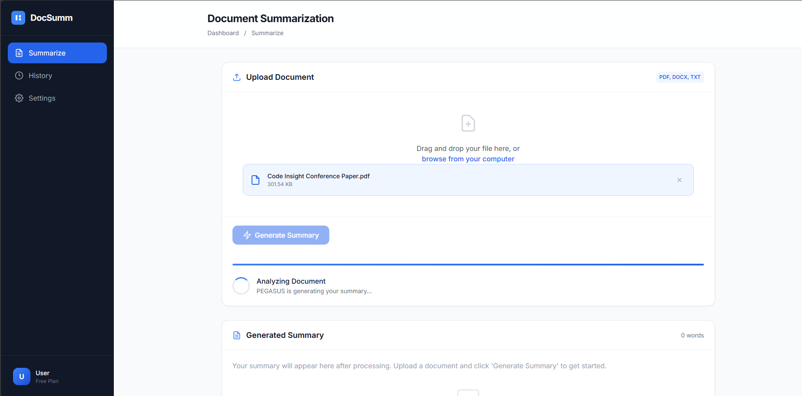
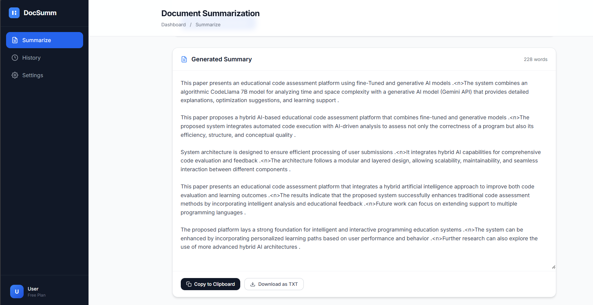
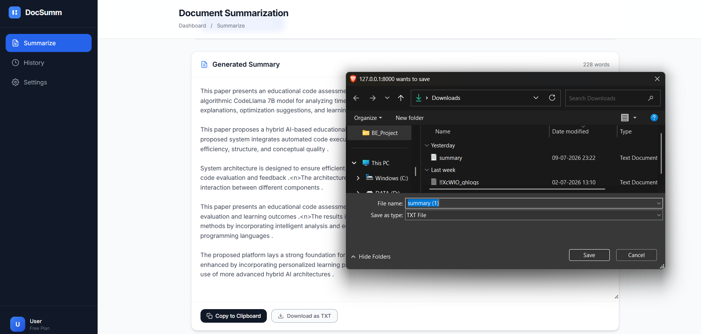

# 📄 Document Summarization System using PEGASUS

An end-to-end **Document Summarization System** built using **Python, FastAPI, Hugging Face Transformers (PEGASUS), HTML, CSS and JavaScript**.

The application accepts **PDF, DOCX and TXT** documents, validates them, extracts text, preprocesses the content, intelligently chunks long documents, generates summaries using Google's **PEGASUS CNN/DailyMail** model, and displays the summarized output through a modern web interface.

---

## ✨ Features

- 📂 Upload PDF, DOCX and TXT documents
- ✅ Automatic document validation
- 📖 Text extraction
- 🧹 Text preprocessing
- ✂ Intelligent token-based chunking
- 🤖 Abstractive summarization using PEGASUS
- 📋 Copy summary to clipboard
- 📥 Download summary as TXT
- 🌐 FastAPI REST API
- 🎨 Modern responsive frontend
- 📝 Modular project architecture

---

# Project Workflow

```
Upload Document
        │
        ▼
Document Ingestion
        │
        ▼
Document Validation
        │
        ▼
Text Extraction
        │
        ▼
Text Preprocessing
        │
        ▼
Token-based Chunking
        │
        ▼
PEGASUS Summarization
        │
        ▼
Merge Chunk Summaries
        │
        ▼
Display Final Summary
```

---

# Tech Stack

## Backend

- Python
- FastAPI
- Hugging Face Transformers
- PEGASUS CNN/DailyMail
- PyTorch

## Frontend

- HTML5
- CSS3
- JavaScript

## Libraries

- transformers
- torch
- PyPDF2
- python-docx
- PyYAML
- python-box
- ensure
- uvicorn
- Jinja2

---

# Project Structure

```text
Document-Summarization-System/
│
├── app.py
├── research/
├── artifacts/
├── src/
|   └── summarizer/
│       ├── components/
│       ├── config/
│       ├── constants/
│       ├── entity/
│       ├── pipeline/
│       ├── logging/
│       └── utils/
│
├── templates/
│      └── index.html
│
├── static/
│      ├── css/
│      ├── js/
│      └── images/
│
├── Dockerfile
├── params.yaml
├── schema.yaml
├── config/
|      ├──config.yaml
├── requirements.txt
└── README.md
```

---

# Screenshots

## Upload Document

> Upload PDF, DOCX or TXT files through the web interface.

<p align="center">

</p>

---


## Generated Summary

> Final summarized output with Copy and Download options.

<p align="center">

</p>

---

## Download Summary

> Download the Generated summary to the Machine

<p align="center">

</p>

---

# Pipeline Stages

## 1. Document Ingestion

- Accepts uploaded files
- Stores documents safely

---

## 2. Document Validation

Checks:

- Supported file format
- File size
- Empty document
- Readability
- Minimum word count

---

## 3. Text Extraction

Supports

- PDF
- DOCX
- TXT

---

## 4. Text Preprocessing

- Remove unnecessary spaces
- Normalize text
- Clean extracted content

---

## 5. Token-based Chunking

Large documents cannot be processed directly because PEGASUS accepts a maximum context length.

The document is therefore divided into overlapping token chunks.

Example:

```
Chunk 1 : Tokens 1 - 450

Chunk 2 : Tokens 401 - 850

Chunk 3 : Tokens 801 - 1250
```

---

## 6. PEGASUS Summarization

Each chunk is independently summarized using

```
google/pegasus-cnn_dailymail
```

---

## 7. Final Summary Generation

All chunk summaries are merged into one final document summary.

---

# API Endpoint

## POST

```
/summarize
```

### Request

Upload a document using multipart/form-data.

Supported:

- PDF
- DOCX
- TXT

### Response

```json
{
    "filename": "document.pdf",
    "summary": "Generated summary..."
}
```

---

# Installation

## Clone Repository

```bash
git clone https://github.com/Pratikpatil-25/Document-Summarization-System-using-PEGASUS.git
```

---

## Create Virtual Environment

```bash
python -m venv doc
```

Activate

Windows

```bash
doc\Scripts\activate
```

Linux/Mac

```bash
source doc/bin/activate
```

---

## Install Dependencies

```bash
pip install -r requirements.txt
```

---

## Run Application

```bash
uvicorn app:app --reload
```

---

# Model

Google PEGASUS CNN/DailyMail

```
google/pegasus-cnn_dailymail
```

The model weights are automatically downloaded the first time the project runs and cached locally by Hugging Face.

---

# Future Improvements

- OCR support for scanned PDFs
- Multi-document summarization
- Extractive + Abstractive summarization
- Summary length customization
- User authentication
- History dashboard
- REST API documentation
- Batch document processing

---

# Author

**Pratik Patil**

GitHub

https://github.com/Pratikpatil-25

---

# License

This project is licensed under the MIT License.